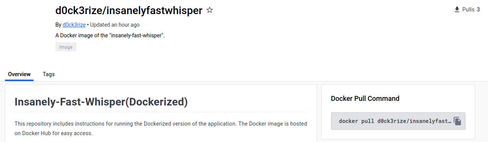
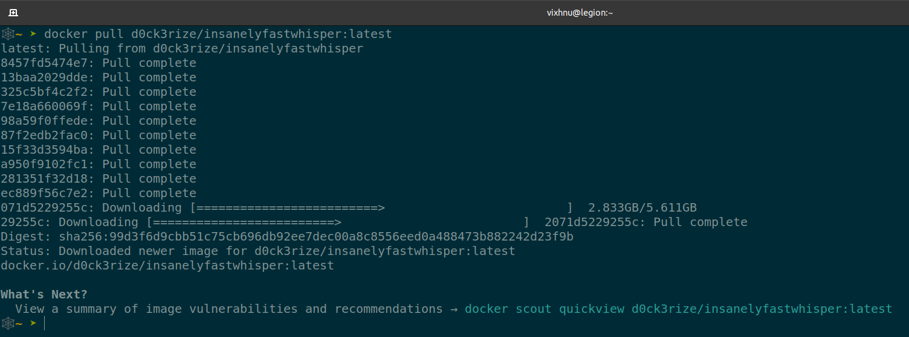
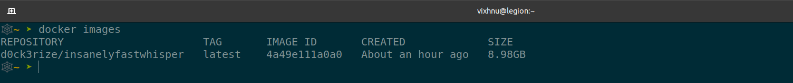
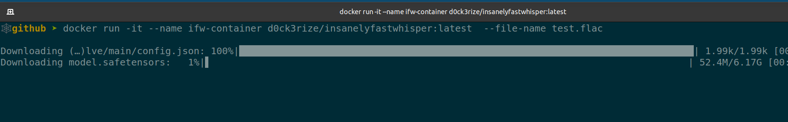
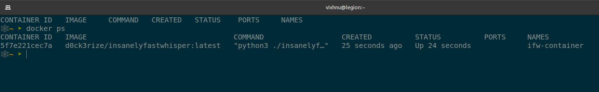

# Insanely-Fast-Whisper(Dockerized)

This includes instructions for running the Dockerized version of the application. The [Docker](https://hub.docker.com/r/d0ck3rize/insanelyfastwhisper) image is hosted on Docker Hub for easy access.

<br>

## Prerequisites

Before getting started, ensure you have [Docker](https://www.docker.com/get-started) installed on your system.

## Usage (CLI)

- #### Pull the Docker image from Docker Hub:

  ```bash
    docker pull d0ck3rize/insanelyfastwhisper:latest
  ```

  
  <br>

- Verify the presence of the Docker image

      ```bash
      docker images
      ```

  
  <br>

- #### Run the Docker image in a container with insanelyfastwhisper arguments

  ```bash
   docker run -it --name <my-container> d0ck3rize/insanelyfastwhisper:latest
  ```

  
  <br>

- To check running containers

```bash
 docker ps
```


<br>
